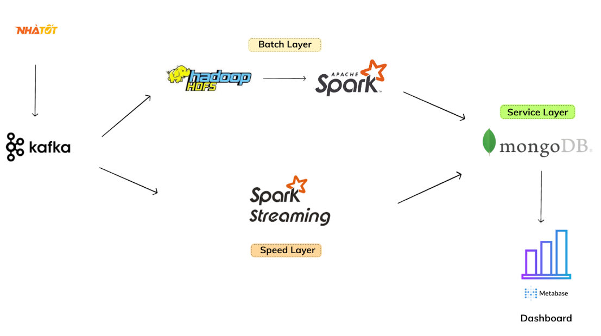
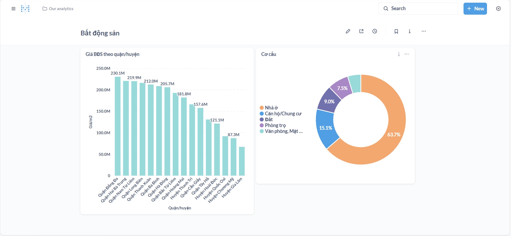

# Hệ thống lưu trữ và xử lý dữ liệu bất động sản, nhà đất

## Project IT4931 - Lưu trữ và xử lý dữ liệu lớn

## Thành viên thực hiện
| Họ và tên | Mã sinh viên |
|----------|--------------|
| Nguyễn Thế Văn (C) | 20220049 |
| Trịnh Ngô Vương An | 20224913 |
| Nguyễn Thị Thuỳ Dung | 20224958 |
| Nguyễn Thanh Nguyên | 20225214 |
| Trần Thị Nhài | 20225371 |

## Kiến trúc hệ thống

## Demo hệ thống

## Hướng dẫn chi tiết
Tài liệu hướng dẫn chi tiết cách cài đặt, triển khai và sử dụng hệ thống được trình bày tại liên kết sau:

- [Hướng dẫn triển khai và sử dụng hệ thống](https://docs.google.com/document/d/1BikZHBTCZRls6LuqYTBvW3gktqun07zb3r6am1l9T6Y/edit?usp=sharing)